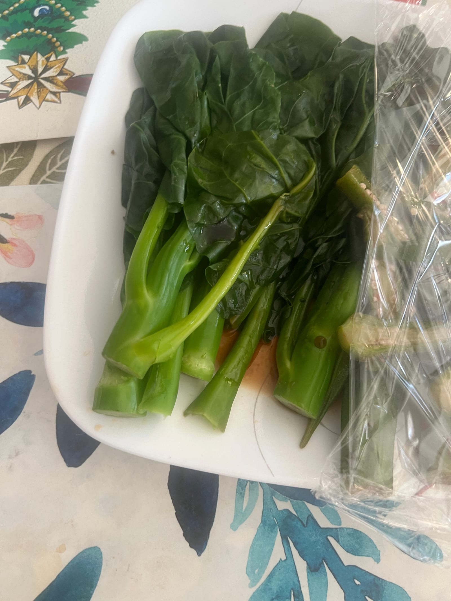
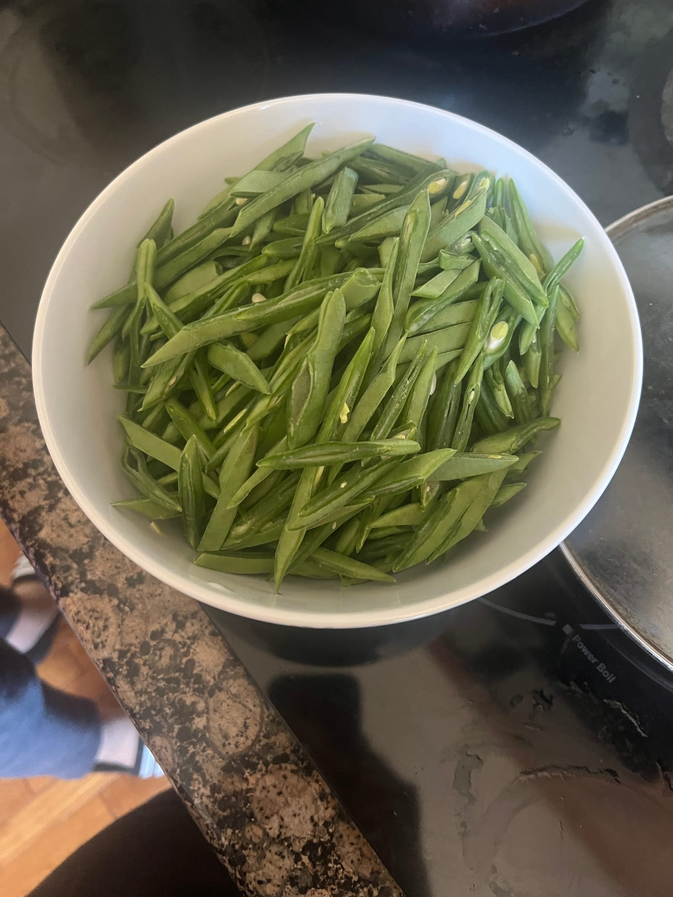
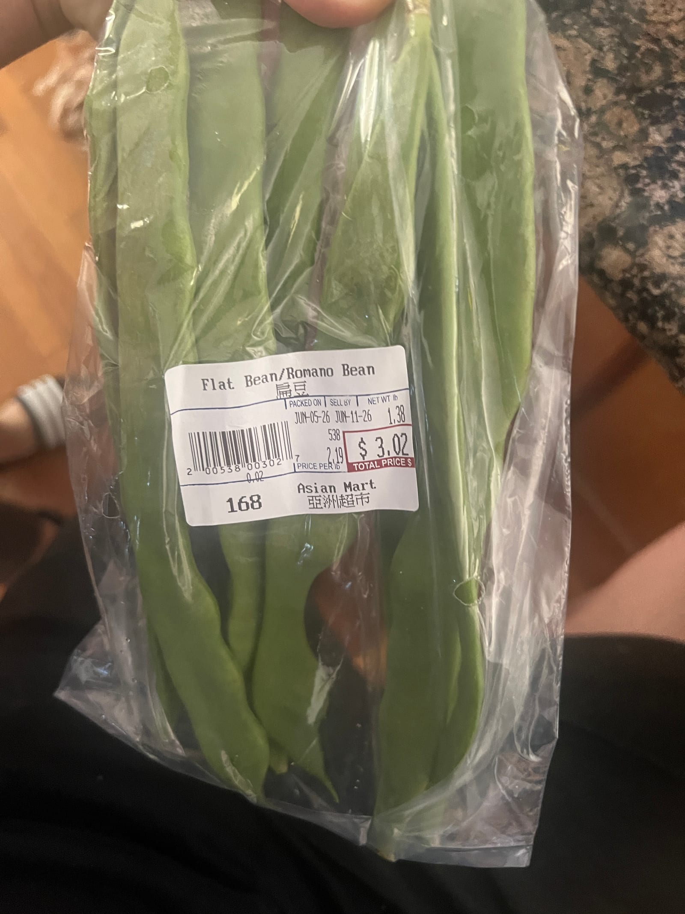

Niu Jing: instant pot, star anise, niu jing, soy sauce, ginger. Soup button. After done, refrigerate. Soy sauce, sesame oil, liang ban Cai zuo liao, xiang cai

Okra: boil, (qun de zhu) i.e don’t cut. Take up, then split up. Soy sauce, sesame oil, liang ban cai zuo liao, a little bit of oyster sauce, a lil vinegar

jie nan cai/芥菜 (jie cai or Gai cai, we’re not sure which one is pu tong Hua. We also can’t find it on Google): boil/tan, take out, soy sauce, sesame oil

Cucumber salad: vinegar, sugar (mom likes a lot), sesame oil, soy sauce

Romano Bean: cut, add oil to pan, garlic/ginger, dou ban jiang, sizzle for a little, then add water to steam. Cook and stir. Flip to cook evenly top and bottom.

Made it with mom; check Google Photos

~ Andrew Chen Wang June 6, 2026 2026-06-06 19:49 EST
