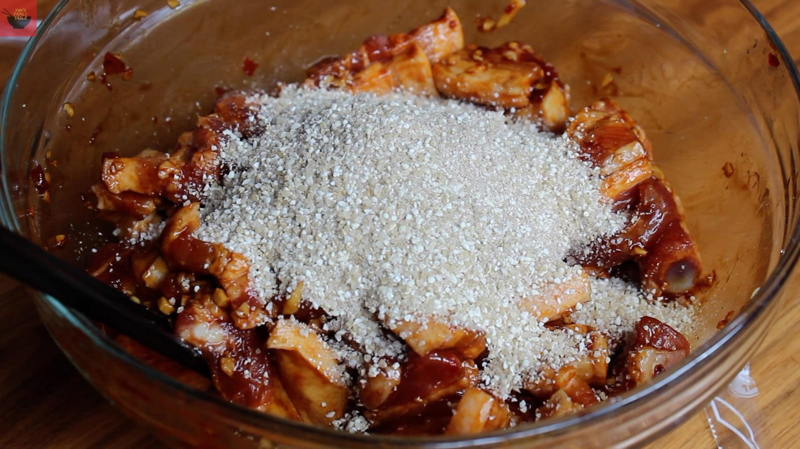
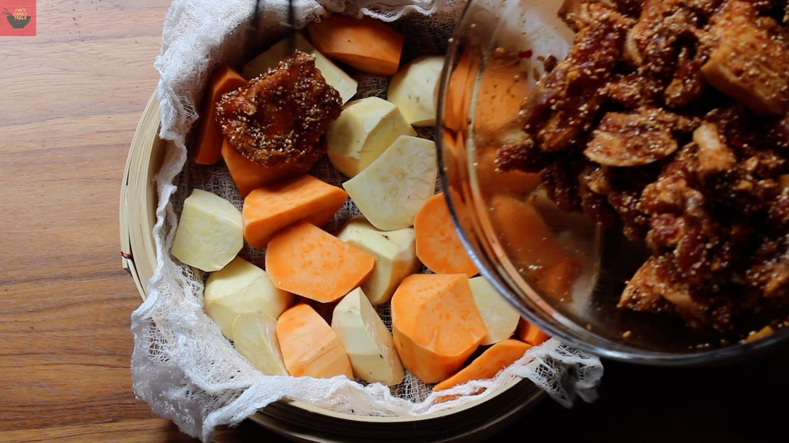

[https://yunsfamilytable.com/recipes/authentic-sichuan-fen-zheng-rou/](https://yunsfamilytable.com/recipes/authentic-sichuan-fen-zheng-rou/)

The Dish Goes Like This:
1. Slice pork belly into 1/2 cm pieces across all the fatty and lean layers.
2. Season the sliced meat with an array of umami filled fermented ingredients. (no need to leave to marinate)
3. Coated it generously with seasoned, toasted, coarsely ground up rice.
4. Spread on top a bed of root veggies.
5. Steam for a long time.

You Will Need

900 g Pork belly  
Not bacon!

1 tsp Sea salt

2 tbsp Light soy sauce

1 tbsp Dark soy sauce

2 tbsp Chinese cooking wine

1 tsp Fermented bean curd  
fǔrǔ, 腐乳

1 tbsp Fermented broad bean chilli paste  
Doubanjiang 豆瓣酱

2 tbsp Chopped fresh ginger

1 tbsp Oyster Sauce

100 g 5 spice rice powder  
~ 2 packages of store bought brand

300 g Vegetables  
ie. potato or sweet potato or soy beans or pumpkin...etc  
Instructions  
**1**  
Slice pork belly across all the layers so that each piece has an even distribution of lean and fat and skin.  
**2**  
Finely chop fresh ginger.  
**3**  
In a large bowl, combine sliced meat with all ingredients except the rice powder. Mix thoroughly.  
**4**  
Add rice powder and make sure it coats even piece of the meat.

**5**  
Prepare the sweet potatoes by peeling and cutting them into large chunks.  
**6**  
Line the bamboo steam with muslin or cheese cloth and put in the sweet potatoes in an even layer. Spread the seasoned meat and rice powder evenly over the potatoes. Close the lid tightly.

**7**  
Steam over high heat for at 1.5 hours. Check the water levels during cooking so you can replenish in case it's cooked off.  
**8**  
Sever immediately in the bamboo steamer.

This is what I had growing up

June 10, 2026
