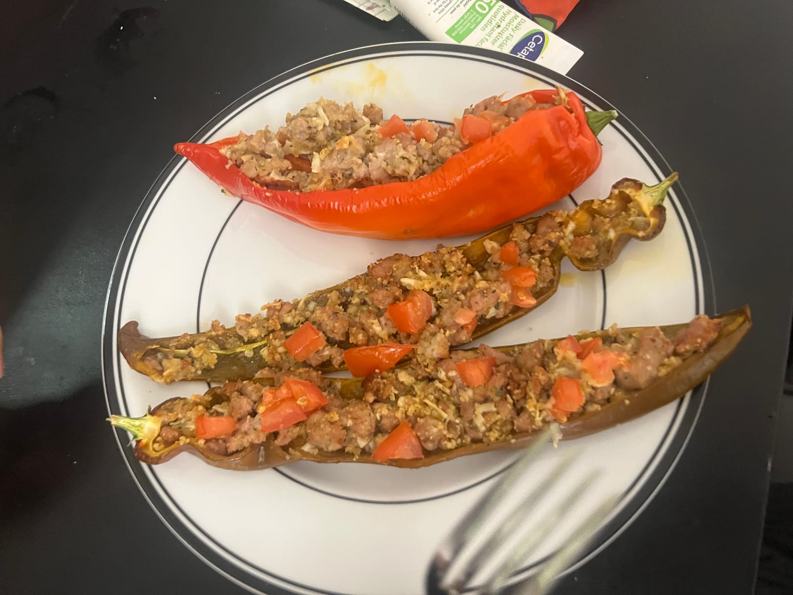
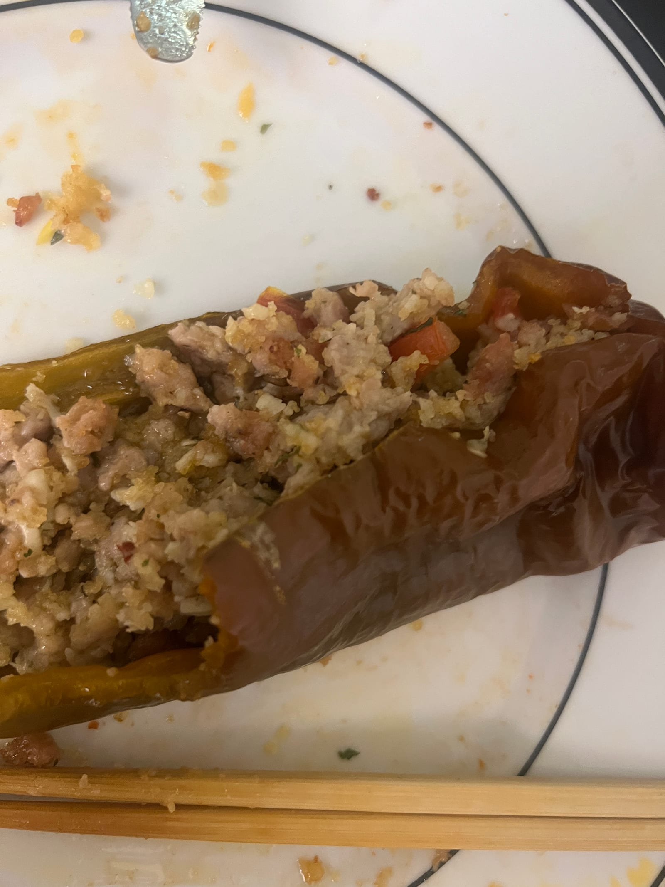

- 3 Italian peppers (they look long) **Peperoni corno di toro**
- 1/2 Italian sausage
- 1 clove of garlic
- Cheese (I used pecorino Romano)
- Salt
- Pepper
- Olive oil
- 1/5 of a large tomato
- Breadcrumbs. Sausage can be salty, so you can lower the amount of sausage and substitute with breadcrumbs. Alternatively, you can add some parsley

Instructions:
- Cook the Italian sausage
- Dice the garlic nice and small
- Grate some cheese, mix with breadcrumbs, tomato, garlic, sausage, and cheese. Add a little bit of salt (optional depending on how much sausage you use vs breadcrumb) and a bit of pepper. Drizzle in olive oil. Mix
- Slice the peppers in half lengthwise and stuff em with your mix

Notes:  
Italian peppers are sweet, especially the red one. The brown one is apparently more prized, and it has an earthy taste, but it tastes almost comparable without being too bitter like green bell peppers. I thoroughly enjoyed the red pepper alone.

The recipe might be called:
- *peperoni corno di toro ricette*
- *peperoni da friggere ricette*
- *peperoni dolci italiani in padella*
- *friggitelli* recipes (different pepper variety, but many preparations work similarly)

And the pepper might be called:
- **Peperoni dolci italiani** (Italian sweet peppers)
- **Peperoni da friggere** (frying peppers)
- **Peperoni corno di toro** ("bull's horn peppers") — the long pointed type that looks very much like your photo
- Sometimes **Corno di bue** (ox horn pepper), depending on region and cultivar

$0.50 at the stall per pepper. So good and sweeter than bell peppers.

~ Andrew Chen Wang June 10, 2026 2026-06-10 20:33 EST
